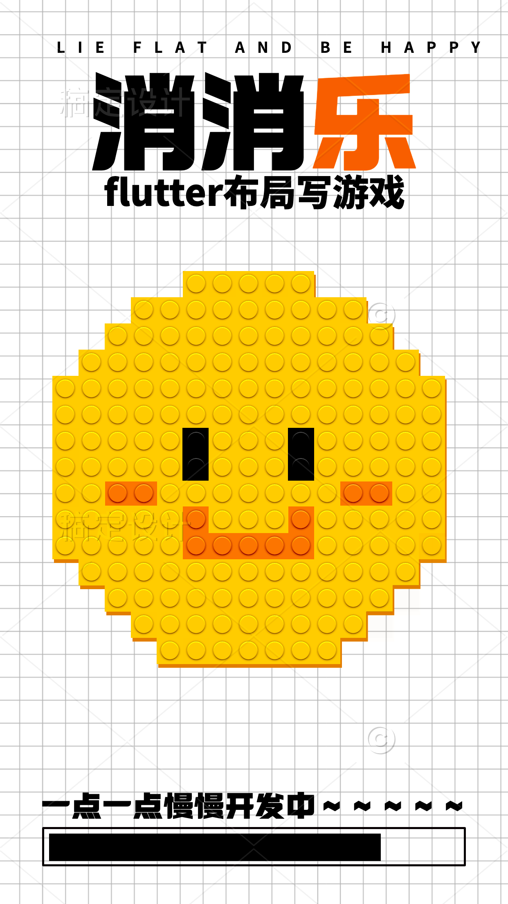

我正在参加掘金社区游戏创意投稿大赛个人赛，详情请看：[游戏创意投稿大赛](https://juejin.cn/post/7077529509724946445)

最近玩了一款消消乐游戏，于是怀疑自己是否也能复刻出一个简单的消消乐，想了想有点挑战性，也该挑战一下自己了。
# 前言：
这是第一版本的消消乐，完成了消消乐最基础的几项能力
1. 交换方块+动画
2. 消除方块+动画
3. 保证棋盘为可消除状态
4. 保证一次消除到底

感兴趣的可以去下面的演示地址体验
[演示地址](https://guuguo.github.io/eliminating/)
> 放在githubPages上，加载略慢，等待十秒左右


**[代码仓库自取](https://github.com/guuguo/flutter_eliminating)**(github)
# 目录：
1. 方块，墙壁和棋盘在代码中表示
2. 完成交换和动画
3. 设计消除算法，动画，并填充消除后的区域
4. 预测能否继续消除，并随机棋盘
5. 最后
# 一、方块，墙壁和棋盘在代码中的表示

我们要设计一个可以自定义关卡的消消乐，关卡的区别就是由不同形状的棋盘组成。这就需要我们将棋盘作为一个可配置项。
根据手机屏幕大小，我们将棋盘定义为一个9*11 的二维整型数组。
### 1. 棋盘代码展示
board代码如下：
```Dart
///墙壁flag
final kB = 0x100;
///未初始化的正常棋盘
final kN = 0;
///方块的正常样式
final kBlockType = 0xFF;
///方块的状态信息
final kBlockStateInfo = 0xFF00;

var board= [
  [kB, kB, kB, kB, kB, kB, kB, kB, kB],
  [kB, kB, kB, kB, kB, kB, kB, kB, kB],
  [kB, kB, kB, kB, kN, kB, kB, kB, kB],
  [kB, kB, kB, kN, kN, kN, kB, kB, kB],
  [kB, kB, kN, kN, kN, kN, kN, kB, kB],
  [kB, kN, kN, kN, kN, kN, kN, kN, kB],
  [kB, kN, kN, kN, kN, kN, kN, kN, kB],
  [kB, kN, kN, kN, kN, kN, kN, kN, kB],
  [kB, kN, kN, kN, kN, kN, kN, kN, kB],
  [kB, kN, kN, kN, kN, kN, kN, kN, kB],
  [kB, kB, kB, kB, kB, kB, kB, kB, kB],
];
```


### 2. 类型和墙壁定义
因为一个各自包含了墙壁信息和方块类型等信息，以及以后可能要加上的冻结，锁链等状态（想太多），所以我们需要对整型进行拆分。


因为类型不多，所以整型的最后一个字节表示0xFF的与结果来表示就够了，足足可以表示0x00-0xFF 256个类型。
然后前面的位数都可以作为标志位使用，我们将0x100作为墙壁标志位，当前也只用到了这个标志位。
所以定好变量，kB就是墙壁，kN就是未初始化方块
上面的二维数组经过映射展示如下。


### 3. 生成棋盘
当前的可用方块还是kN 也就是0。还没有初始化出各式各样的方块。因为方块有六种类型，所以直接用随机数输生成1-6的数字。代码如下。
```Dart
generateBlocks() {
  print("随机棋盘");
  for (var i = 0; i < board.length; i++) {
    for (var j = 0; j < board[i].length; j++) {
       ///墙壁不必随机
      if (board[i][j] & kB != 0) {
        continue;
      }
      ///随机只复制最后一个字节，避免清除状态（先拿到状态信息，然后再和随机数结合）
      board[i][j] = board[i][j] & kBlockStateInfo | (Random().nextInt(6) + 1);
    }
  }
}
```
我们随机的时候只给整型最后一个字节的类型区域赋值，避免清除其他墙壁，冰块等状态(虽然还没有实现)，代码的实现逻辑见注释
### 4. 映射资源
图标资源来自[iconfont](https://www.iconfont.cn/collections/index?spm=a313x.7781069.1998910419.4&page=9)网站。随便找找多彩图标，过得去就行。
棋盘的布局大意如下：
```Dart
///棋盘布局  Stack[ 背景,  方块 ] 
///方块布局  Column套Row
Column(
  mainAxisSize: MainAxisSize.min,
  crossAxisAlignment: CrossAxisAlignment.center,
  children: logic.board
      .mapIndexed((i, row) => Row(
            mainAxisSize: MainAxisSize.min,
            children: row
                .mapIndexed((j, e) => GameBlockWidget(
                      e,
                      Point(i, j),
                    ))
                .toList(),
          ))
      .toList(),
);
```
`GameBlockWidget`就是我们定义的方块。
> 因为后面要对方块加动画，所以背景和方块分开布局，毕竟背景是不动的。背景主要是颜色和边框的布局，边框判断是否在方块边上，如果是就给边框。详细可以看源码。
映射出图片的代码就在`GameBlockWidget`中，我们简单判断映射就好了:
```Dart
if (widget.type & kB == 0) {
  final blockType = widget.type & kBlockType;
  String asset;
  if (blockType == 1) {
    ///水壶
    asset = Res.shuihu;
  } else if (blockType == 2) {
    ///花束
    asset = Res.huashu;
  } else if (blockType == 3) {
    ///沙发
    asset = Res.shafa;
  } else if (blockType == 4) {
    ///手机
    asset = Res.shouji;
  } else if (blockType == 5) {
    ///水晶球
    asset = Res.shuijingqiu;
  } else if (blockType == 6) {
    ///小熊
    asset = Res.xiaoxiong;
  } else {
    asset = Res.shuihu;
  }
  child = Image.asset(asset);
}
```
主要就是用Image组件展示对应图片。
# 二、完成交换和动画
###  1. 动画的实现
交换动画使用的是flutter中使用起来最最最简单的 `AnimatedSlide` 组件。
> 该组件只要在更新组件期间(`didUpdateWidget` 调用的时候触发)，发现offset改变，会自动执行动画。这个组件也是继承与AnimatedWidget，里面帮我们封装好了各种操作，里面的弯弯道道以后好好学习下源码。
在交换动画中，使用一个枚举`BlockAnimState`标识动画执行过程。
```Dart
enum BlockAnimState {
  no,
  ready,
  anim,
}
```
在每次刷新组件的时候，根据标识状态来改变组件。顺序如下：
1. 在 BlockAnimState.no 状态下，展示方块本来的组件。
2. 在 BlockAnimState. **ready 状态下，对于需要动画的方块，包裹上AnimatedSlide 组件，并将offset置为初始状态。**
3. 在 BlockAnimState. **ready 对于需要动画的方块的 AnimatedSlide 组件的offset 置为动画完成状态。**
4. 期间注意在每次更新界面的时候，预留好动画执行的时间。
   很简单就完成了动画。
   `AnimatedSlide`的用法很简单，如下所示：
```Dart
AnimatedSlide(
           offset: controller.blockSwitchAnim==BlockAnimState.ready?Offset.zero:Offset(-slidDy.toDouble(), -slidDx.toDouble()),
           duration: const Duration(milliseconds: kBlockAnimDuration),
           curve: Curves.bounceIn,
           child: child);
     }
```
### 2. 交换的细节
对于消消乐而言，交互无非是
1. 按下一个方块，获取焦点
2. 按下另一个方块
3. 如果两个方块临近，就交换
4. 如果两个方块不临近，就更换焦点
   流程简单明了，所以我们使用`GeatureDetector`进行按下手势捕获,并在focusBlock方法中判断交换，大致代码如下：
```Dart
///点击事件
GestureDetector(
  onTapDown: (detail)async  {
    var controller = Get.find<GameController>();
    ///聚焦方块
    bool swap=await controller.focusBlock(detail.localPosition);
  },
  child:child)
  
///返回是否交换
Future<bool> focusBlock(Offset localPosition) async {
///计算是第几个方块
  final i = localPosition.dy ~/ kBlockSize;
  final j = localPosition.dx ~/ kBlockSize;
  if (isBorderWithXY(i, j)) return false;

  ///当选在之前选中块的边上，交换
  ///当距离太远，更新焦点方块
  if (currentFocus != null) {
    if ((i - currentFocus!.x).abs() == 1 &&
            (j - currentFocus!.y).abs() == 0 ||
        ((i - currentFocus!.x).abs() == 0 &&
            (j - currentFocus!.y).abs() == 1)) {
      targetBlock = Point(i, j);

      ///交换
      await swapWithAnim(currentFocus!, targetBlock!);

      ///消除代码
      if(eliminateAll()){
      }
      ///无法消除取消交换
      else {
        await swapBack();
        return false;
      }
    }
  }
  currentFocus = Point(i, j);
  downLocalPosition = localPosition;
  update();
  return false;
}
```
里面涉及的`swapWithAnim`方法功能就是交换方块并伴随动画，所有等待都通过Future实现。细节在上面小节
# 三、设计消除算法，动画，并填充消除后的区域
对于消消乐来说，最重要的当然就是消除算法了。
### 1. 设计思路
要保证棋盘一直处于消除过的状态，以及在交换之后进行的消除动作都需要该算法来支撑。接下来就简单说说我的消除算法的设计。
1. 遍历棋盘数组，判断每一个方块的横向往右或者竖向往下有没有三连同样类型的方块
2. 新建和棋盘大小一致的消除数组，记录可消除的方块信息到其中。
3. 消除，并填充方块（忽略墙壁）
   1. 新建每列队列，从顶部开始遍历棋盘的每一列。
   2. 对于无需消除的方块到队列尾部。对于需要消除的方块，随机一个新类型的方块添加到队列。
   3. 将队列赋值给棋盘对应列
      利用了一个棋盘大小的新空间，基本上是一次遍历完成了算法，消除，动画，随机填充一气呵成，效率还行。
      对应的动画的实现方案和交换动画一样，只是将`AnimatedSlide`替换成了`AnimatedScale`(对应代码在源码中)。
### 2. 具体代码
具体算法代码如下：
```Dart
///消除应该消除的并重新随机
///如果成功消除了  返回true，失败了 返账false
///是否用户触发的消除，用户触发的需要动画，并在后期计算分值
Future<bool> eliminateAll({bool byUser = false,VoidCallback? beforeEliminate}) async {
  eliminateMarkResult = markNeedEliminate(board);
  if (eliminateMarkResult == null) return false;
  beforeEliminate?.call();
  ///等待消除动画
  if (byUser) {
    eliminateAnim = BlockAnimState.ready;
    update();
    await delay(kAnimReadyDuration);
    eliminateAnim = BlockAnimState.anim;
    update();
    await delay(kBlockElimintateAnimDuration);
    eliminateAnim = BlockAnimState.no;
  }
  Queue<int> list = Queue();
  for (var j = 0; j < board[0].length; j++) {
    ///消除方格
    for (var i = 0; i < board.length; i++) {
      ///如果是墙壁，不看了
      if (board[i][j] & kB != 0) {
        continue;
      }

      if (eliminateMarkResult![i][j] == 0) {
        list.addLast(board[i][j]);
      } else {
        ///插入应该填充的标志
        list.addFirst(-1);
      }
    }
    for (var i = 0; i < board.length; i++) {
      ///如果是墙壁，不看了
      if (board[i][j] & kB != 0) {
        continue;
      }
      final node = list.removeFirst();
      if (node == -1) {
        board[i][j] =
            board[i][j] & kBlockStateInfo | (Random().nextInt(6) + 1);
      } else {
        board[i][j] = node;
      }
    }
  }
  return true;
}
```
# 四、预测能否继续消除，并随机棋盘
### 1. 为啥需要预测
光是实现消除还不能玩，因为一旦死局就凉凉了。在玩消消乐过程中甚至是一开始初始随机出的棋盘都可能出现死局。我们需要在出现死局的时候直接随机出一个可用的棋盘。
这就需要我们拥有预测期盼能否消除的能力。
还有就是市面上的消消乐基本都有动态提示用户的功能，这也需要我们知道当前哪里可以消除。
### 2. 算法设计思路
预测死局算法设计思路和消除算法类似(预测的前提是，当前消除过，不会有三连及以上存在)。步骤如下：
1. 遍历每个方块
   1. 如果横向二连了（如图2和3），检查前一个（1）和后一个（4）周边有没有同类方块
   2. 如果横向检查当前和间隔方块类型一致（如图1和3），检查中间那个（2）能否交换出三连
   3. 如果竖向二连了（如图2和3），检查前一个（1）和后一个（4）能否交换出三连。
   4. 竖向间隔了，交换中间尝试


1. 如果遍历到的方块有解，可被消除，中断遍历，预测为可消除。
### 3. 具体代码
```Dart
///检测当前棋盘是否可被消除(棋盘需要是消除过的状态，不能当前就可消除)
bool detectCanEliminate() {
  ///[fromDirect]消除来源方向 0 左，1 上，2 右，3下
  bool checkSurround(int targetType, int i, int j,
      int fromDirect) {
    ///边界外直接返回false
    if (i < 0 || i >= board.length || j < 0 || j >= board.length) {
      return false;
    }


    if (fromDirect & CheckFromDirect.left == 0 &&
        getTypeWithXY(i, j - 1) == targetType) {
      return true;
    }
    if (fromDirect & CheckFromDirect.top == 0 &&
        getTypeWithXY(i - 1, j) == targetType) {
      return true;
    }
    if (fromDirect & CheckFromDirect.right == 0 &&
        getTypeWithXY(i, j + 1) == targetType) {
      return true;
    }
    if (fromDirect & CheckFromDirect.bottom == 0 &&
        getTypeWithXY(i + 1, j) == targetType) {
      return true;
    }
    return false;
  }

  ///检测该格子可否被预测消除
  for (var i = 0; i < board.length; i++) {
    for (var j = 0; j < board[i].length; j++) {
      ///如果是墙壁，不看了
      if (board[i][j] & kB != 0) {
        continue;
      }
      final type = getTypeWithXY(i, j);

      ///如果不是正常的方块，下一步
      if (type == 0) continue;

      ///如果横向二连了，检查首尾周围有无同类
      if (getTypeWithXY(i, j + 1) == type) {
        if (checkSurround(type, i, j - 1, CheckFromDirect.right)) {
          return true;
        }
        if (checkSurround(type, i, j + 2, CheckFromDirect.left)) {
          return true;
        }
        ///如果横向间隔二连了，检查中间有无同类
      } else if (getTypeWithXY(i, j + 2) == type) {
        if (checkSurround(type, i, j + 1, CheckFromDirect.right)) {
          return true;
        }
      }
      ///如果竖向二连了，检查首尾周围有无同类
      if (getTypeWithXY(i + 1, j) == type) {
        if (checkSurround(type, i - 1, j, CheckFromDirect.bottom)) {
          return true;
        }
        if (checkSurround(type, i + 2, j, CheckFromDirect.top)) {
          return true;
        }
        ///如果竖向间隔二连了，检查中间有无同类
      } else if (getTypeWithXY(i + 2, j) == type) {
        if (checkSurround(type, i + 1, j, CheckFromDirect.bottom)) {
          return true;
        }
      }
    }
  }
  return false;
}
```
# 五、最后
最后的最后，我们还需要串联起这些功能。
1. 保证初始棋盘可用 -> 初始化的时候随机棋盘，利用消除算法保证棋盘不在消除中，利用预测算法保证棋盘可被消除
2. 在交换后利用消除和预测算法计分，多次消除
   这样就完成了消消乐的一直可以玩了～～
   后面其实还可以优化，但我就先弄到这里啦～
## Todo
- 引入flame引擎，优化增强一些游戏效果
- 加入计分系统，和关卡目标